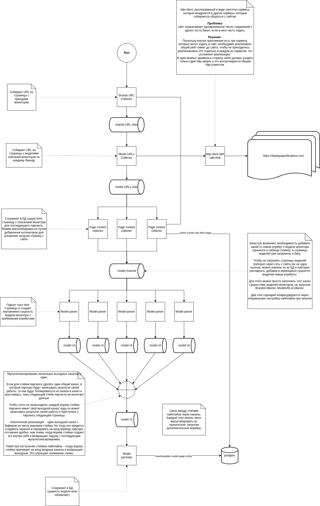
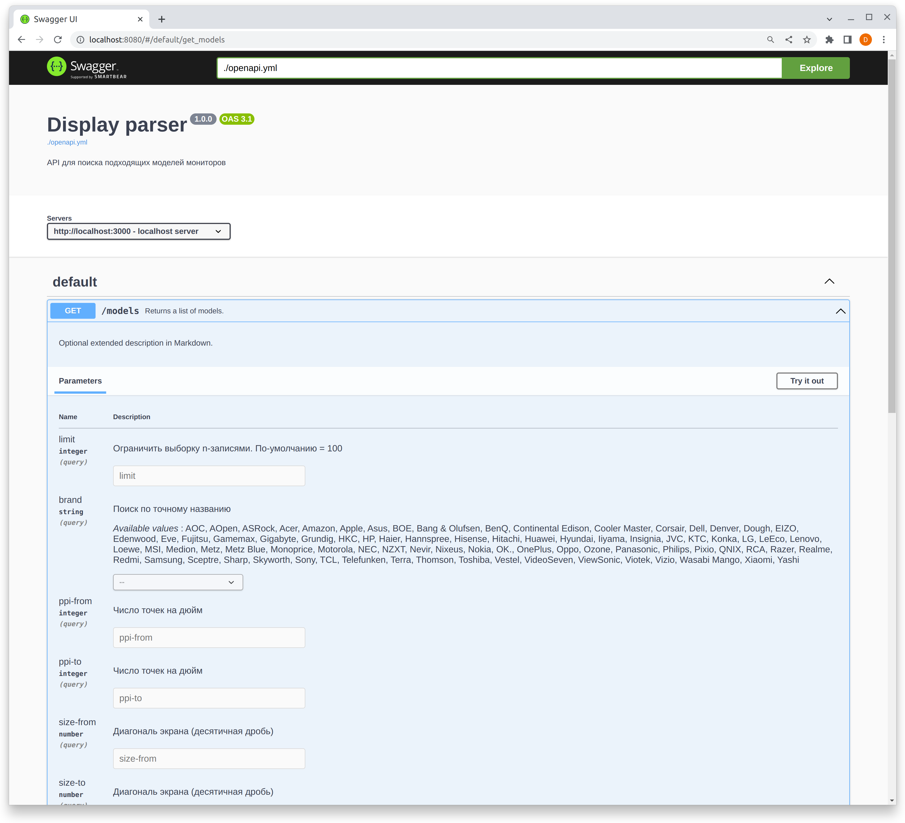

# Дисклеймер
Проект представляет собой всего лишь пример кода и не претендует на то, чтобы выступать в роли эталонного проекта или примером того, как нужно делать. Ту же задачу можно решить множеством иных более простых/сложных способов. Может содержать ошибки и неоптимальные решения, которые исправляются по мере моего интереса и возможности.

#### Про пайплайны.
В реализации применяется подход с пайплайнами, но от себя скажу, что он заходит далеко не во всех задачах и за все время я сталкивался буквально с несколькими ситуациями, где его применение было действительно оправдано и не приводило к усложнению архитектуры. Поскольку данный проект носит больше учебно-развлекательный характер, здесь можно встретить различные решения, которые могут не подходить тому или иному проекту.

# Предыстория
Это реализация простого парсера сайта с моделями мониторов **displayspecifications.com**.

Когда-то у меня возникла проблема выбора нового монитора, но большинство маркетплейсов по какой-то причине не имели у себя фильтра по параметру PPI (число точек на дюйм), который был для меня определяющим фактором при выборе.

По этой причине ради спортивного интереса, решил спарсить все существующие мониторы с сайта.
Затем загрузить данные в базу и простым запросом вытянуть модели, которые удовлетворяют моим критериям.

В дальнейшем превратилось в пример для демонстрации своего кода.
# Запуск на локальной машине
Для работы потребуется:
* docker
* docker-compose

Что будет запущено:
* **postgres** (`localhost:5432`)
* **http-сервер** с API для поиска по моделям распаршеных мониторов (`http://localhost:3000`)
* **swagger-ui** для удобства работы с HTTP-API (`http://localhost:8080`).
* **sql-migrate** накатит при своем запуске актуальные миграции

Процесс:
1. Соберем финальные образы приложения:
```shell
$ make image
```

2. Запустим инфру:
```shell
$ docker-compose up
```

Запустим парсер (по-умолчанию не запускается):
```shell
$ docker-compose run app
```

У приложения есть флаги, которые позволяют регурировать число воркеров, загружающих страницы с сайта и задержки между запросами.
**Не рекомендуется их менять, если до конца не уверены в результате.**

**Если опрашивать сайт слишком часто, вас могут забанить и загрузка страниц остановится.**

# Описание реализации
### Кратко о том, что сделано
Впринципе, стандартный набор:
- использование **make** для управления повседневными задачами
- управление пакетами через **go mod**
- dockerfile с multistage-build (`make image`)
- автогенерация моков на интерфейсы приложения (`make mock`)
- основной код покрыт табличными юнит-тестами (`make test`)
- запуск линтов (`make lint`)
- изменения схемы БД накатываются с помощью миграций (`make migrate`)
- быстрый старт с помощью docker-compose (`make run-docker`)
- API для просмотра моделей мониторов (`./cmd/http`, слушает 3000 порт)
- основное приложение, собирающее данные (`./cmd/app`)
- процесс загрузки и обработки данных выстроен в пайплайн
- работа с флагами командной строки для конфигурирования работы
- graceful shutdown
- использование context.Context в рамках приложения для корректной работы "отмен" (http, db, внутренние сервисы)
- документирование API с помощью OpenAPI

Что не реализовано:
- метрики
- трейсинг
- враппер для логгера
- structured logging

### Принцип работы
В начале приложение собирает список существующих на сайте брендов мониторов.
Каждая страница с брендом содержит полный список мониторов, произведенных им.
Затем URL страницы с брендом передается в коллектор моделей мониторов.
Он в свою очередь собирает URL на конкретные модели мониторов и передает их непосредственно парсеру страниц монитора.
Парсер страниц разбирает их, извлекая требуемые параметры, наполняя внутреннюю сущность (internal/domain/model.go) данными.
Затем сущность сохраняется в БД.

После того, как парсер отработал - можно ручками идти в БД и составлять произвольные запросы для поиска нужного монитора по требуемым критериям.

### Шаги пайплайна
Приложение представляет из себя пайплайн (https://go.dev/blog/pipelines), состоящий из нескольких этапов:
1. Сборщик URL брендов мониторов (**internal/services/pipeline/brands_collector.go**)
2. Сборщик URL страниц, на которых содержатся ссылки на модели мониторов (**internal/services/pipeline/pages_collector.go**)
3. Сборщик URL на модели мониторов бренда (**internal/services/pipeline/models_url_collector.go**)
4. Парсер страницы с описанием монитора (**internal/services/pipeline/model_parser.go**)



# Описание команд
Холодный старт:

```shell
make run
```

Запуск в режиме использования кэша страниц (когда все страницы с сайта уже загружены в базу и нужно перестраивать сущности моделей):

```shell
make run-page-cache
```

Прогон линтеров:
```shell
make lint
```

Прогон тестов:
```shell
make test
```

Сборка docker-образа:
```shell
make image
```

# Сборка
Сборка реализована с помощью multistage-build в docker.
Для сборки docker-образов достаточно вызвать:
```shell
make image
```

Как устроена:
- Сначала в отдельном стейже тянем вендоров и собираем исполняемые файлы.
- Затем в отдельном стейже подготавливается базовый, легковесный образ на основе alpine, где будут жить исполняемые файлы.
- После чего отдельными стейжами формируется итоговый образ, куда копируется бинарь.
- под каждый бинарь билдится свой образ (см. `make image`) под соответствующий стейж

Благодаря использованию мультистейж билдов, мы можем переиспользовать те или иные артефакты на промежуточных стадиях. 
После выполнения команды `make image` получаем следующие образы:
```shell
➜  display_parser git:(master) ✗ sudo docker images
REPOSITORY               TAG       IMAGE ID       CREATED             SIZE
display_parser-http      latest    dae82e78ed10   4 minutes ago       15.3MB
display_parser-app       latest    514a5debf071   4 minutes ago       20.6MB
```
Благодаря использованию builder-кэша, общее время сборки финального образа занимает несколько секунд (обычно на это уходят минуты), а сам образ занимает на диске порядка ~30Мб.
# TODO
#### High:

#### Average
1. реализовать враппер для логгера
2. structured logger with context
3. функциональный тест на пайплайн

#### Low:
- https://github.com/golang-migrate/migrate
- функциональный тест на http-endpoint с мокнутым веб-сервером

# Q&A по реализации:
**Почему задействован пайплайн, когда можно было бы написать последовательный код, это же просто парсер?**
Да, можно просто написать последовательный код (вместо разделения на этапы и связывания их через каналы) и в нужный момент запускать горутины для распараллеливания каких-то операций.
В данном случае цель заключается в демонстрации применения подхода с пайплайнами на простом примере с парсингом сайта, где процесс состоит из множества частей.


**Где может пригодиться подход с пайплайнами?** Когда нужно явно разбить какую-то задачу на этапы и нужно произвольно масштабировать каждый из них (запускать больше/меньше горутин в рамках этапа пайплайна, по потребности).
Сами этапы связываются посредством каналов. При этом, реализация каждого этапа **явно** отделена от другой, что делает код более поддерживаемым и масштабируемым за счет того, чот логика обработки не размазывается/не смешивается с другими частями приложения.
Применение пайплайнов оправдано не во всех задачах, поэтому данный код нужно воспринимать лишь как демонстрацию подхода.
**TODO** подумать над формулировкой  первого предложения

# Тесты
```shell
$ make test
go mod vendor
go clean -testcache
go test -v ./...
?       display_parser/cmd/app  [no test files]
?       display_parser/cmd/http [no test files]
?       display_parser/internal/config  [no test files]
?       display_parser/internal/config/service_cfg      [no test files]
?       display_parser/internal/domain  [no test files]
?       display_parser/internal/iface   [no test files]
?       display_parser/internal/iface/db        [no test files]
=== RUN   Test_parseModelQuery
=== RUN   Test_parseModelQuery/parse_year-from
=== RUN   Test_parseModelQuery/parse_year-to
=== RUN   Test_parseModelQuery/parse_incorrect_year-from
=== RUN   Test_parseModelQuery/parse_incorrect_year-to
=== RUN   Test_parseModelQuery/parse_size-from
=== RUN   Test_parseModelQuery/parse_size-to
=== RUN   Test_parseModelQuery/parse_incorrect_size-to
=== RUN   Test_parseModelQuery/parse_incorrect_size-from
=== RUN   Test_parseModelQuery/parse_ppi-from
=== RUN   Test_parseModelQuery/parse_ppi-to
=== RUN   Test_parseModelQuery/parse_incorrect_ppi-to
=== RUN   Test_parseModelQuery/parse_incorrect_ppi-from
=== RUN   Test_parseModelQuery/full_query
--- PASS: Test_parseModelQuery (0.00s)
    --- PASS: Test_parseModelQuery/parse_year-from (0.00s)
    --- PASS: Test_parseModelQuery/parse_year-to (0.00s)
    --- PASS: Test_parseModelQuery/parse_incorrect_year-from (0.00s)
    --- PASS: Test_parseModelQuery/parse_incorrect_year-to (0.00s)
    --- PASS: Test_parseModelQuery/parse_size-from (0.00s)
    --- PASS: Test_parseModelQuery/parse_size-to (0.00s)
    --- PASS: Test_parseModelQuery/parse_incorrect_size-to (0.00s)
    --- PASS: Test_parseModelQuery/parse_incorrect_size-from (0.00s)
    --- PASS: Test_parseModelQuery/parse_ppi-from (0.00s)
    --- PASS: Test_parseModelQuery/parse_ppi-to (0.00s)
    --- PASS: Test_parseModelQuery/parse_incorrect_ppi-to (0.00s)
    --- PASS: Test_parseModelQuery/parse_incorrect_ppi-from (0.00s)
    --- PASS: Test_parseModelQuery/full_query (0.00s)
PASS
ok      display_parser/cmd/http/controllers     0.003s
?       display_parser/internal/services        [no test files]
=== RUN   TestModelQuery_Validate
=== RUN   TestModelQuery_Validate/correct_year-from/year-to
=== RUN   TestModelQuery_Validate/incorrect_year-from_>_year-to
=== RUN   TestModelQuery_Validate/year-from_<_0
=== RUN   TestModelQuery_Validate/year-to_<_0
=== RUN   TestModelQuery_Validate/correct_ppi-from/ppi-to
=== RUN   TestModelQuery_Validate/incorrect_ppi-from_>_ppi-to
=== RUN   TestModelQuery_Validate/ppi-from_<_0
=== RUN   TestModelQuery_Validate/ppi-to_<_0
=== RUN   TestModelQuery_Validate/correct_size-from/size-to
=== RUN   TestModelQuery_Validate/size-from_>_size-to
=== RUN   TestModelQuery_Validate/size-from_<_0
=== RUN   TestModelQuery_Validate/size-to_<_0
=== RUN   TestModelQuery_Validate/brand_passed,_valid=true
=== RUN   TestModelQuery_Validate/empty_brand_passed,_valid=true
=== RUN   TestModelQuery_Validate/correct_limit_passed
=== RUN   TestModelQuery_Validate/limit_<_0_passed
=== RUN   TestModelQuery_Validate/limit_==_0_passed
--- PASS: TestModelQuery_Validate (0.00s)
    --- PASS: TestModelQuery_Validate/correct_year-from/year-to (0.00s)
    --- PASS: TestModelQuery_Validate/incorrect_year-from_>_year-to (0.00s)
    --- PASS: TestModelQuery_Validate/year-from_<_0 (0.00s)
    --- PASS: TestModelQuery_Validate/year-to_<_0 (0.00s)
    --- PASS: TestModelQuery_Validate/correct_ppi-from/ppi-to (0.00s)
    --- PASS: TestModelQuery_Validate/incorrect_ppi-from_>_ppi-to (0.00s)
    --- PASS: TestModelQuery_Validate/ppi-from_<_0 (0.00s)
    --- PASS: TestModelQuery_Validate/ppi-to_<_0 (0.00s)
    --- PASS: TestModelQuery_Validate/correct_size-from/size-to (0.00s)
    --- PASS: TestModelQuery_Validate/size-from_>_size-to (0.00s)
    --- PASS: TestModelQuery_Validate/size-from_<_0 (0.00s)
    --- PASS: TestModelQuery_Validate/size-to_<_0 (0.00s)
    --- PASS: TestModelQuery_Validate/brand_passed,_valid=true (0.00s)
    --- PASS: TestModelQuery_Validate/empty_brand_passed,_valid=true (0.00s)
    --- PASS: TestModelQuery_Validate/correct_limit_passed (0.00s)
    --- PASS: TestModelQuery_Validate/limit_<_0_passed (0.00s)
    --- PASS: TestModelQuery_Validate/limit_==_0_passed (0.00s)
PASS
ok      display_parser/internal/repository      0.002s
?       display_parser/mocks    [no test files]
=== RUN   TestBrandsCollector_Run
=== RUN   TestBrandsCollector_Run/parsing_index_page_for_collect_brand_URLs
=== NAME  TestBrandsCollector_Run
    HTTPClient.go:88: PASS:     Do(mock.AnythingOfTypeArgument)
--- PASS: TestBrandsCollector_Run (0.00s)
    --- PASS: TestBrandsCollector_Run/parsing_index_page_for_collect_brand_URLs (0.00s)
=== RUN   TestModelParser_parsePPI
=== RUN   TestModelParser_parsePPI/parse_correct_PPI
=== RUN   TestModelParser_parsePPI/parse_incorrect_PPI_--_want_error
--- PASS: TestModelParser_parsePPI (0.00s)
    --- PASS: TestModelParser_parsePPI/parse_correct_PPI (0.00s)
    --- PASS: TestModelParser_parsePPI/parse_incorrect_PPI_--_want_error (0.00s)
=== RUN   TestModelParser_parse
=== RUN   TestModelParser_parse/full_page_parse
--- PASS: TestModelParser_parse (0.00s)
    --- PASS: TestModelParser_parse/full_page_parse (0.00s)
=== RUN   TestModelPersister_Run
=== RUN   TestModelPersister_Run/create_new_entity
    ModelRepository.go:238: PASS:       Create(mock.AnythingOfTypeArgument,mock.AnythingOfTypeArgument)
=== RUN   TestModelPersister_Run/update_existing_entity
    ModelRepository.go:238: PASS:       Update(mock.AnythingOfTypeArgument,mock.AnythingOfTypeArgument)
--- PASS: TestModelPersister_Run (0.00s)
    --- PASS: TestModelPersister_Run/create_new_entity (0.00s)
    --- PASS: TestModelPersister_Run/update_existing_entity (0.00s)
=== RUN   TestPageCollector_Run
=== RUN   TestPageCollector_Run/create_new_page
=== NAME  TestPageCollector_Run
    PageRepository.go:193: PASS:        Find(mock.AnythingOfTypeArgument,mock.AnythingOfTypeArgument)
    PageRepository.go:193: PASS:        Create(mock.AnythingOfTypeArgument,mock.AnythingOfTypeArgument)
    HTTPClient.go:88: PASS:     Do(mock.AnythingOfTypeArgument)
--- PASS: TestPageCollector_Run (0.00s)
    --- PASS: TestPageCollector_Run/create_new_page (0.00s)
PASS
ok      display_parser/internal/services/pipeline       0.007s

```


# OpenAPI
Веб-интерфейс (Swagger-UI) доступен в рамках отдельного контейнера, запускаемого с помощью **docker-compose**.

Если стартовать сервис штатным способом (`make run-docker`), то можно обратиться к нему по URL `http://localhost:8080`.


