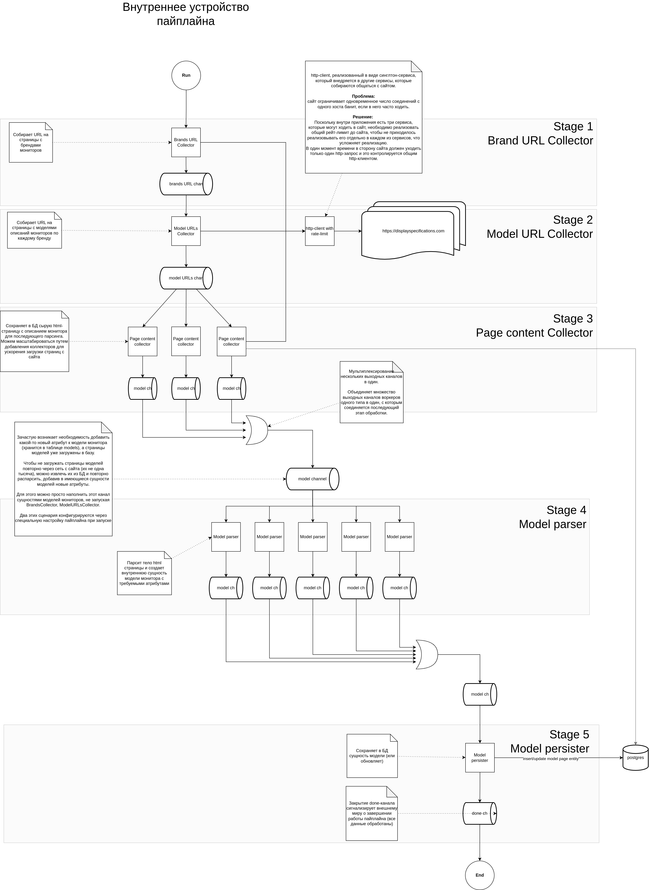

# Дисклеймер
Проект представляет собой всего лишь пример кода и не претендует на то, чтобы выступать в роли эталонного проекта или примером того, как нужно делать. Ту же задачу можно решить множеством иных более простых/сложных способов. Может содержать ошибки и неоптимальные решения, которые исправляются по мере моего интереса и возможности.

#### Про пайплайны.
В реализации применяется подход с пайплайнами, но от себя скажу, что он заходит далеко не во всех задачах и за все время я сталкивался буквально с несколькими ситуациями, где его применение было действительно оправдано и не приводило к усложнению архитектуры. Поскольку данный проект носит больше учебно-развлекательный характер, здесь можно встретить различные решения, которые могут не подходить тому или иному проекту.
# Предыстория
Это реализация простого парсера сайта с моделями мониторов **displayspecifications.com**.

Когда-то у меня возникла проблема выбора нового монитора, но большинство маркетплейсов по какой-то причине не имели у себя фильтра по параметру PPI (число точек на дюйм), который был для меня определяющим фактором при выборе.

По этой причине ради спортивного интереса, решил спарсить все существующие мониторы с сайта.
Затем загрузить данные в базу и простым запросом вытянуть модели, которые удовлетворяют моим критериям.

В дальнейшем превратилось в пример для демонстрации своего кода.

# Описание реализации
### Кратко о том, что сделано
Впринципе, стандартный набор:
- использование **make** для управления повседневными задачами
- управление пакетами через **go mod**
- dockerfile с multistage-build (`make image`)
- автогенерация моков на интерфейсы приложения (`make mock`)
- основной код покрыт табличными юнит-тестами (`make test`)
- запуск линтов (`make lint`)
- изменения схемы БД накатываются с помощью миграций (`make migrate`)
- быстрый старт с помощью docker-compose (`make run-docker`)
- API для просмотра моделей мониторов (`./cmd/http`, слушает 3000 порт)
- основное приложение, собирающее данные (`./cmd/app`)
- процесс загрузки и обработки данных выстроен в пайплайн
- работа с флагами командной строки для конфигурирования работы
- graceful shutdown
- использование context.Context в рамках приложения для корректной работы "отмен" (http, db, внутренние сервисы)
- документирование API с помощью OpenAPI

Что не реализовано:
- метрики
- трейсинг
- враппер для логгера
- контекстное логирование

### Принцип работы
В начале приложение собирает список существующих на сайте брендов мониторов.
Каждая страница с брендом содержит полный список мониторов, произведенных им.
Затем URL страницы с брендом передается в коллектор моделей мониторов.
Он в свою очередь собирает URL на конкретные модели мониторов и передает их непосредственно парсеру страниц монитора.
Парсер страниц разбирает их, извлекая требуемые параметры, наполняя внутреннюю сущность (internal/domain/model.go) данными.
Затем сущность сохраняется в БД.

После того, как парсер отработал - можно ручками идти в БД и составлять произвольные запросы для поиска нужного монитора по требуемым критериям.

### Шаги пайплайна
Приложение представляет из себя пайплайн (https://go.dev/blog/pipelines), состоящий из нескольких этапов:
1. Сборщик URL брендов мониторов (**internal/services/pipeline/brands_collector.go**)
2. Сборщик URL страниц, на которых содержатся ссылки на модели мониторов (**internal/services/pipeline/pages_collector.go**)
3. Сборщик URL на модели мониторов бренда (**internal/services/pipeline/models_url_collector.go**)
4. Парсер страницы с описанием монитора (**internal/services/pipeline/model_parser.go**)



# Описание команд
Холодный старт:

```shell
make run
```

Запуск в режиме использования кэша страниц (когда все страницы с сайта уже загружены в базу и нужно перестраивать сущности моделей):

```shell
make run-page-cache
```

Прогон линтеров:
```shell
make lint
```

Прогон тестов:
```shell
make test
```

Сборка docker-образа:
```shell
make image
```

# Сборка
Сборка реализована с помощью multistage-build в docker.
Для сборки docker-образов достаточно вызвать:
```shell
make image
```

Как устроена:
- Сначала в отдельном стейже тянем вендоров и собираем исполняемые файлы.
- Затем в отдельном стейже подготавливается базовый, легковесный образ на основе alpine, где будут жить исполняемые файлы.
- После чего отдельными стейжами формируется итоговый образ, куда копируется бинарь.
- под каждый бинарь билдится свой образ (см. `make image`) под соответствующий стейж
Благодаря использованию мультистейж билдов, мы можем переиспользовать те или иные артефакты на промежуточных стадиях. 
После выполнения команды `make image` получаем следующие образы:
```shell
➜  display_parser git:(master) ✗ sudo docker images
REPOSITORY               TAG       IMAGE ID       CREATED             SIZE
display_parser-http      latest    dae82e78ed10   4 minutes ago       15.3MB
display_parser-app       latest    514a5debf071   4 minutes ago       20.6MB
```

# Используемые пакеты
* mockery
* testify
* goqu
* sql-migrate
* cobra
* zap
* pq

# TODO
#### High:
3. cmd's
4. использовать ID модели в качестве PK вместо URL
5. 

#### Average
1. REST API
2. Swagger
1. реализовать враппер для логгера
2. сделать хранение параметров логгера в гошном контексте
3. config (env, command line params)

#### Low:

# Q&A по реализации:
**Почему задействован пайплайн, когда можно было бы написать последовательный код, это же просто парсер?**
Да, можно просто написать последовательный код (вместо разделения на этапы и связывания их через каналы) и в нужный момент запускать горутины для распараллеливания каких-то операций.
В данном случае цель заключается в демонстрации применения подхода с пайплайнами на простом примере с парсингом сайта, где процесс состоит из множества частей.


**Где может пригодиться подход с пайплайнами?** Когда нужно явно разбить какую-то задачу на этапы и нужно произвольно масштабировать каждый из них (запускать больше/меньше горутин в рамках этапа пайплайна, по потребности).
Сами этапы связываются посредством каналов. При этом, реализация каждого этапа **явно** отделена от другой, что делает код более поддерживаемым и масштабируемым за счет того, чот логика обработки не размазывается/не смешивается с другими частями приложения.
Применение пайплайнов оправдано не во всех задачах, поэтому данный код нужно воспринимать лишь как демонстрацию подхода.
**TODO** подумать над формулировкой  первого предложения
